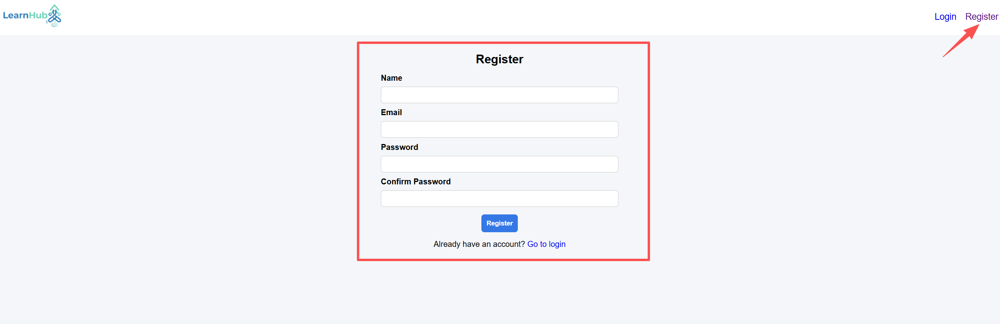
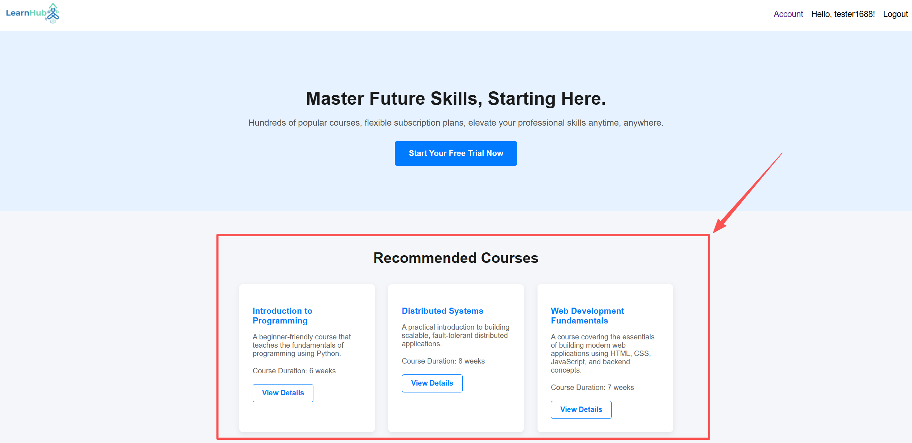
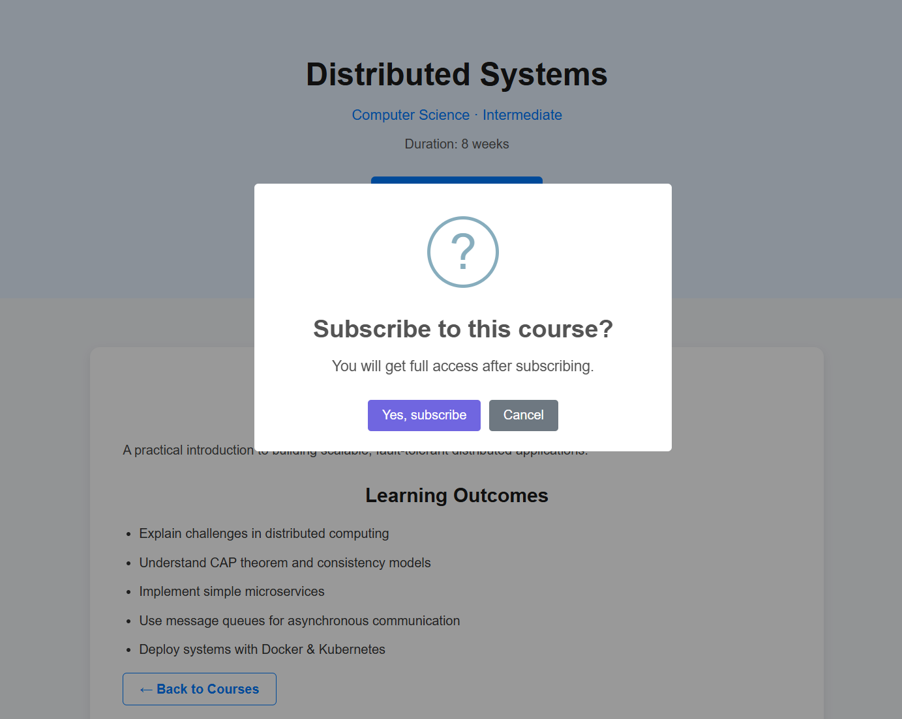
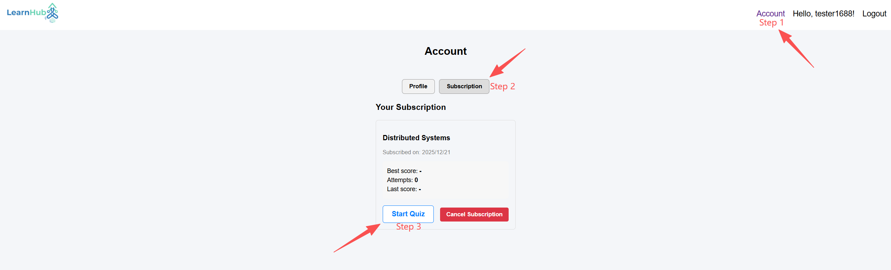
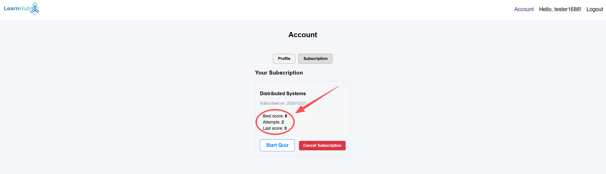

# LearnHub – Distributed Microservices Learning Platform

## Watch the System Demo Below

<p align="center">
  <a href="https://youtu.be/BIWgT2HYaFU">
    
  </a>
</p>

<p align="center"><b>▶ Click to watch the full architecture and feature walkthrough</b></p>

---

LearnHub is a distributed online learning platform that supports user management, course delivery, quizzes, and learning progress tracking. The project was developed with a primary focus on architectural reasoning, trade-offs, and distributed systems principles rather than feature completeness.


## Feature Overview

### Authentication

Users can register and log in using JWT-based authentication.



### Course Catalogue

Users can browse available courses and subscribe to begin learning.



### Quiz System

Each course includes quizzes. Users can start and submit quizzes, with results processed by the distributed backend services.





### Learning Progress Tracking

Learning progress and quiz results are aggregated and exposed through a dedicated read-side API.



> Progress updates are processed asynchronously via RabbitMQ and may appear with a short delay.


## System Architecture

LearnHub adopts a microservices-based architecture. Each major domain responsibility is implemented as an independent service with its own codebase and data store. Services communicate using a combination of synchronous REST APIs and asynchronous messaging.

### Services

- User Service (Flask): user registration, authentication, subscriptions, and profiles
- Course Service (Flask): course metadata and course content
- Quiz Service (Flask): quiz questions and answer submission
- Progress Processor Service (write side, folder name `progress-service`): consumes quiz submission events from RabbitMQ, computes progress metrics, and persists aggregated learning progress data
- Progress Query Service (read side, folder name `progress-api`): exposes APIs to query user learning progress and quiz results

### Communication Patterns

- Synchronous communication: REST APIs for user-facing operations and queries
- Asynchronous communication: RabbitMQ for quiz submission events processed by the Progress Processor Service

## Technology Stack

- Frontend: Flask (server-side rendered HTML)
- Reverse Proxy: NGINX
- Backend Services: Flask (User, Course, Quiz), FastAPI (Progress Query)
- Messaging: RabbitMQ (CloudAMQP)
- Databases:
  - MongoDB for user, course, and progress data
  - Turso (SQLite compatible) for quiz data
- Authentication: JWT
- Containerisation and orchestration: Docker and Docker Compose
- Deployment: Google Cloud Platform

## Running Locally (Docker Compose)

### Prerequisites

- Docker Desktop or Docker Engine
- Docker Compose (v2 recommended, using `docker compose`)

### Setup and Run

1. Clone the repository:
   
   ```
   git clone https://github.com/Peja016/ds-group-project.git  
   cd ds-group-project
   ```

2. Create a `.env` file in the repository root.  
   This project expects external services such as MongoDB, CloudAMQP (RabbitMQ), and Turso. You may use free-tier cloud instances or equivalent local services.

3. Build and start all services:
   
   ```
   docker compose up --build
   ```

4. Access the application via the NGINX entry point as defined in `docker-compose.yml`.

5. Stop the system:
   
   ```
   docker compose down
   ```

## Environment Variables

Create a `.env` file in the repository root. Typical environment variables include:

- JWT_SECRET
- MONGODB_URI
- RABBITMQ_URL
- TURSO_DATABASE_URL
- TURSO_AUTH_TOKEN

Additional service URLs may be required depending on configuration:

- USER_SERVICE_URL
- COURSE_SERVICE_URL
- QUIZ_SERVICE_URL
- PROGRESS_API_URL

Use the exact variable names expected by the service configuration and `docker-compose.yml`.

## Verifying Local Functionality

After starting the system locally:

1. Open the frontend through the NGINX entry point.
2. Register a user and log in.
3. Browse courses.
4. Start and submit a quiz.
5. View learning progress and quiz results.
   Note: progress updates may be delayed briefly due to asynchronous processing.

## Repository Structure

- `user-service/` User Service (Flask)
- `course-service/` Course Service (Flask)
- `quiz-service/` Quiz Service (Flask) with Turso integration
- `progress-service/` Progress Processor Service (write side)
- `progress-api/` Progress Query Service (read side, FastAPI)
- `docker-compose.yml` Docker Compose configuration


